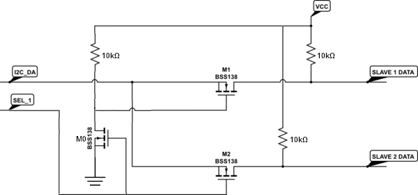

# Custom components for ESPHome

Usage in ESPHome:

```yaml
external_components:
- source: github://smkent/esphome@main
  components: [ component_1_name, component_2_name, ... ]
```

## I2Cx2

Switch between two I2C data (SDA) lines using an additional GPIO pin and MOSFETs

Adapted from [this StackOverflow
circuit](https://electronics.stackexchange.com/a/209031) with an added MOSFET as
a NOT gate (I used 2N7000 MOSFETs):



Example usage:

```yaml
i2c:
- id: i2c0
  sda: 8
  scl: 9
  scan: false

i2cx2:
  i2c_id: i2c0
  pin: 20
  first_bus_pin_state: true
  virtual_buses:
  - bus_id: i2c0_high
    scan: true
  - bus_id: i2c0_low
    scan: true
```
